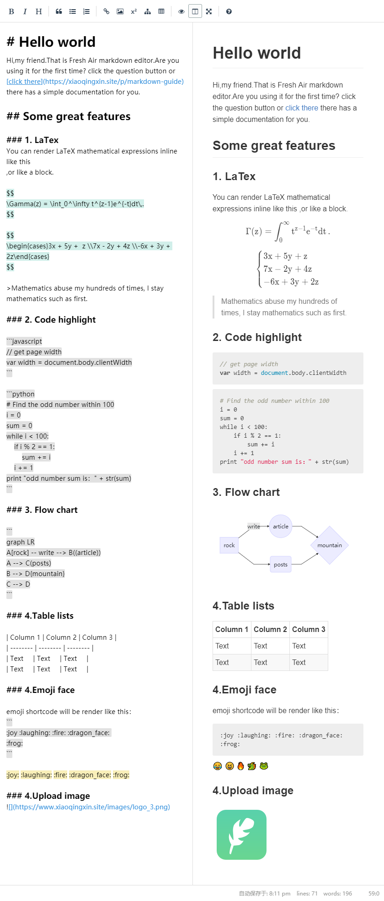
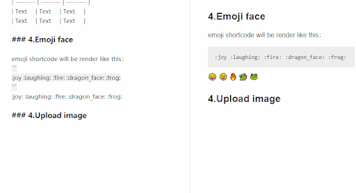
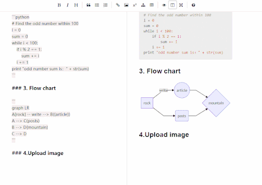

# Smartmd

<p align="center">
 <a href="./docs/api.md">Documentation</a> | <a href="./docs/api_cn.md">中文文档</a>
</p>
<p align="center">
<a href="https://travis-ci.org/NoisyWinds/smartmd"></a>
<a href="LICENSE"></img></a>
<a href="https://laravel.com"></img></a>
</p>
A markdown text editor compatible almost all markdown syntax, like Mathematical formula、flowchart、upload images...  

##  Screenshots
editor demo: [Demo](https://xiaoqingxin.site/editor/write)   
js render page [Demo](https://xiaoqingxin.site/editor/js-show)  
php render page [Demo](https://xiaoqingxin.site/editor/php-show)
  
  
  --- 
   
  ---
  

## Get smartmd
```node
npm install smartmd 
```
```html
<head>
<link rel="stylesheet" href="dist/smartmd.min.css">
<script src="dist/smartmd.min.js"></script>
</head>
```
## Quickstart
```javascript
var editor = new Smartmd({
   el: "#editor",
   height: "400px"
});
```
## Build Setup
```node
# install reference
npm install smartmd 

# build for development
npm run dev

# build for production
npm run build
```

## Features
- Markdown syntax parse by Markdown-It and it's plugins
- LaTeX mathematical expressions using KaTeX
- Diagrams and flowcharts using Mermaid
- Live preview 
- Emoji
- Images upload (need server)

## Issue
welcome repo bug reports, feature requests or optimization method.

### Reference:
- CodeMirror [link](https://github.com/codemirror/CodeMirror) 
- Simplemde-markdown [link](https://github.com/sparksuite/simplemde-markdown-editor)
- markdown-it (markdown render) [link](https://github.com/markdown-it/markdown-it)
- mermaid (flowchart) [link](https://github.com/knsv/mermaid)
